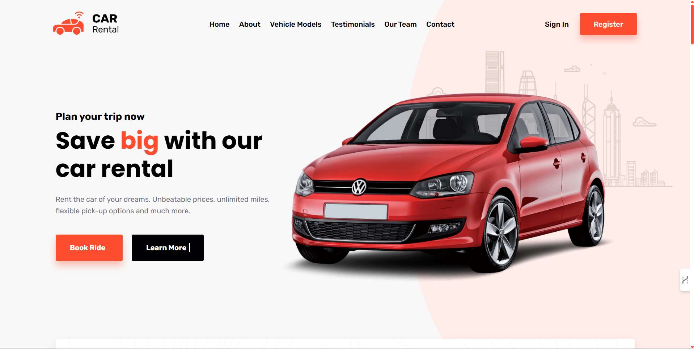

## 📸 Screenshots

### 🏠 Homepage


### 🚘 Car Details Page


# 🚗 Car Rental Frontend

An intuitive and modern **Car Rental** web application built with **React** and **Sass**.  
This platform allows users to browse, compare, and reserve cars with ease — perfect for both personal and business use.


---

## ✨ Features

- 🏎️ Explore a wide range of rental cars by model, brand, size, and price
- 🔍 Easy-to-use search and filter interface
- 💻 Responsive design for mobile and desktop
- 🎨 Styled using SCSS for modular and scalable styling
- ⚡ Fast and interactive UI built with React

---

## 🛠️ Built With

- **React JS** – Frontend framework for dynamic UI
- **Sass / SCSS** – Styling with reusable components
- **JavaScript (ES6+)** – Logic and interactivity
- **HTML5 + CSS3** – Core web technologies

---

## 🚀 Getting Started

Follow these instructions to set up and run the project on your local machine.

### ✅ Prerequisites

Ensure you have the following installed:

- [Node.js](https://nodejs.org/) (v12 or higher)
- npm (comes with Node.js)

### 🔄 Installation

1. **Clone the repository**:
   ```bash
   git clone https://github.com/Hemalatha-dot/Car-Rental-Frontend.git
   ```

2. **Navigate into the project directory**:
   ```bash
   cd Car-Rental-Frontend
   ```

3. **Install all dependencies**:
   ```bash
   npm install
   ```

---

## ▶️ Running the Project

Start the development server:

```bash
npm start
```

Then visit: [http://localhost:3000](http://localhost:3000)

The app will reload automatically as you make changes.

---

## 🎨 Styling with Sass

Sass is used for modular, nested styling. Sass files are located in:

```
src/styles/
```

### To compile Sass manually (if needed):

```bash
npm run build-css
```

This will convert your `.scss` files to `.css`.

---

## 📦 Available NPM Scripts

```bash
npm start        # Run development server
npm run build    # Build for production
npm run test     # Run tests
npm run eject    # Eject CRA config (not recommended unless necessary)
```

---

## 📁 Project Structure (Simplified)

```
Car-Rental-Frontend/
├── public/
├── src/
│   ├── components/      # React components
│   ├── pages/           # Page-level components
│   ├── styles/          # SCSS styling files
│   ├── App.js
│   └── index.js
├── .gitignore
├── package.json
├── README.md
└── ...
```

---

## 📌 TODO (Optional Enhancements)

- ✅ Add car filter by brand, price, or size
- 🔒 Integrate user authentication
- 📍 Add map/location-based car search
- 📱 Improve mobile responsiveness

---

## 🧑‍💻 Author

**Hemalatha-dot**  
[GitHub Profile](https://github.com/Hemalatha-dot)

---

## 📄 License

This project is licensed under the **MIT License** — see the [LICENSE](LICENSE) file for details.

---

## 🙌 Acknowledgements

- [Create React App](https://create-react-app.dev/)
- [Sass Official Docs](https://sass-lang.com/guide)
